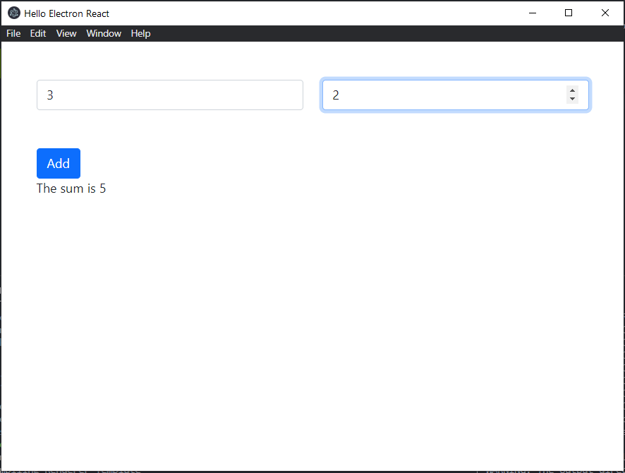

# Electron, React, and Python all-in-one

This is a barebones desktop app that starts a python process in the background to do processing as if it were a webserver.

The final product is a distributable package that can be run on any desktop environment, no python/node/electron needed!

The frontend is rendered with React.

The final distributable is packaged with Electron-Forge using their webpack template

## Setup

First, build the python distributable
```
cd backend
python -m venv env
env\scripts\activate.bat
pip install -r requirements.txt
pyinstaller app.py
```

Then, build the frontend
```
cd ..\my-new-app
yarn
yarn make
```

The final distribution will be in my-new-app\out 

## Product

After making the project, we can run my-new-app.exe in my-new-app\out\my-new-app-win32-x64\my-new-app.exe

The other folder in "\out\" contains the distributable installer for our app.

The main window will start:



We can start task manager to verify the python app has started as well:


- app.exe is our python executable created with pyinstaller
- Hello Electron React is the renderer process
- my-new-app is the main process